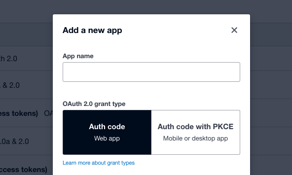
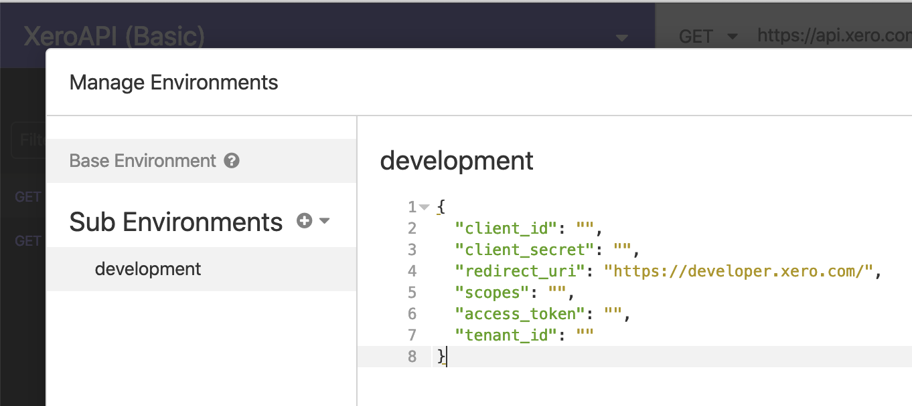
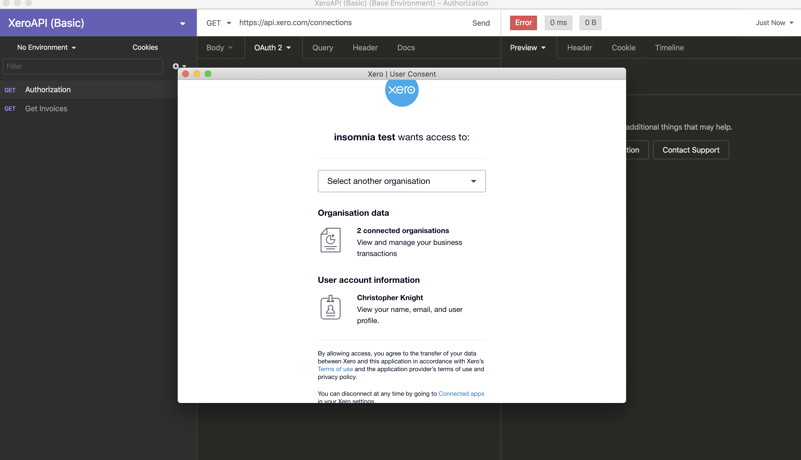
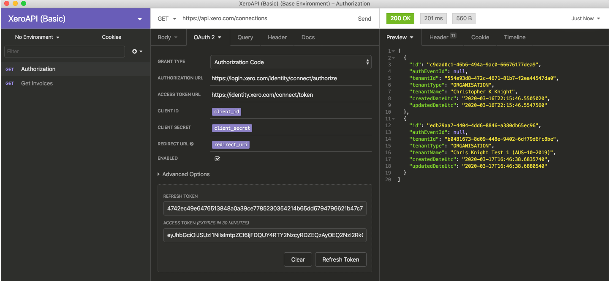
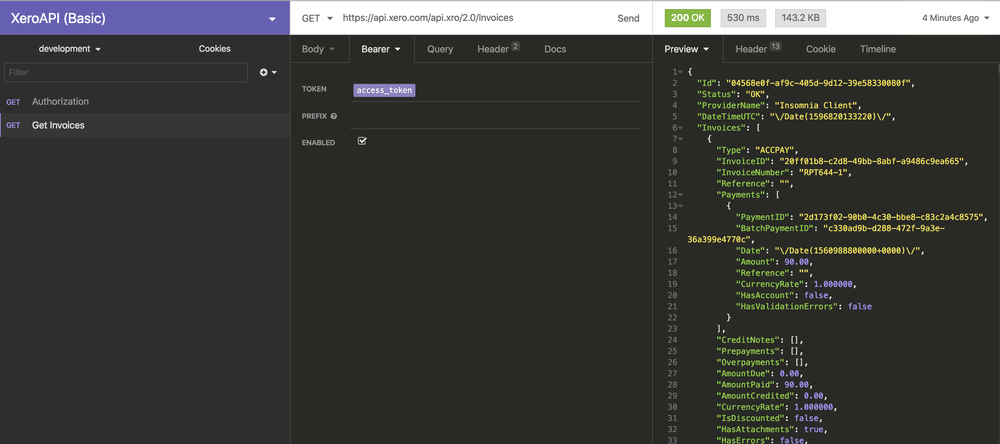

# Xero-Insomnia
An Insomnia collection for authenticating to and calling many of the Xero API endpoints.

## Steps to get up and running
Follow these steps to quickly get up and running with the Xero API and Insomnia.

---

### 1. Download Insomnia Client
Visit Insomnia and download the desktop client.
> http://insomnia.rest/

---

### 2. Create an API app
> https://developer.xero.com/myapps

In the Xero developer portal create an API app. If you haven't signed up for a xero account you can [signup here](https://www.xero.com/signup/api/).

----

## 3. Pick a collection to import

### **Import (XeroAPI Basic collection)**
_This collections has a single authentication route and one sample API call._

&uri=https%3A%2F%2Fraw.githubusercontent.com%2FSerKnight%2FXero-Insomnia%2Fmaster%2FInsomnia_basic.json)

---

### **Import (XeroAPI Full Collection)**
_This collection has the majority of the XeroAPI endpoints already built out._

&uri=https%3A%2F%2Fraw.githubusercontent.com%2FSerKnight%2FXero-Insomnia%2Fmaster%2FInsomnia_full.json) 

---

### 4. Add your client_id, client_secret, and scopes to the environment variables in Insomnia
Get the id & secrete from your /myapps API app.

Then read & pick your scopes.
> https://developer.xero.com/documentation/oauth2/scopes

At a minimun you probably want `"openid profile email offline_access accounting.transactions"`. If you chose the **Full Collection** you will have to add (_basically_) every scope to access all imported endpoints.

Finally, copy those 3 items into this file in your desktop client.

---

### 5. Authorize Xero and and get your access_token

Click 'Fetch Tokens' which will prompt a Xero login screen.

Once you return it should populate the access & refresh token.

You can now click `Send` which will hit the `/connections` endpoint and return your active API connections. Chose a `tenant_id`.

Then paste both the `tenant_id` & the `access_token` into the environment file.

---

### 6. Paste the access_token back into your environment variables
Once you have an `access_token` plugged in, you will be able to make API calls.

---
### 7. Refresh token for continued access
You can continually visit the `Authentication` route to refresh a token by clicking `Refresh Token`.

---

**IMPORTANT** you need tocopy/paste a refreshed `access_token` into the env variables section each refresh

(_~13 min video tutorial on setting up Insomnia from scratch_)
> https://www.youtube.com/watch?v=H_k8Z8Zq99s